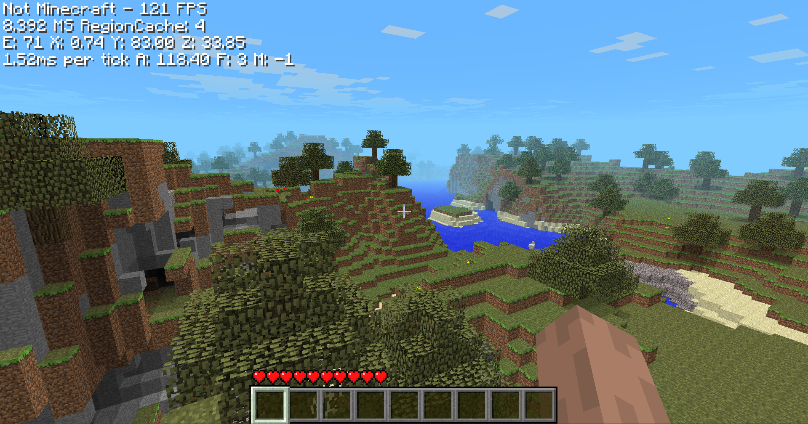

# Not Minecraft

A custom C++ implementation of Minecraft Alpha. It originally started its life as a Wii port before being converted into a native PC project.
This is not a clean room implementation, it was written while looking at a decompilation of Alpha 1.2.6

## Building

### Windows

Just open the solution it should compile (Requires VS 2026)
You need to get the textures from the alpha 1.2.6 jar file (look in Runtime/mc/textures.txt for more info)

### Linux / Mac

¯\_(ツ)_/¯

## Dependencies

 - [SDL3](https://github.com/libsdl-org/SDL) - Windowing, input, and platform abstraction
 - [zlib](https://github.com/madler/zlib) - For handling region files, world compression, and NBT data
 - [miniaudio](https://github.com/mackron/miniaudio) - Audio playback

### Inspiration & Resources
* [Inspired by (also some code for the hand animations from here)](https://github.com/xtreme8000/CavEX)
* [Terrain Generation](https://github.com/b3spectacled/modern-beta-fabric)
* MCRegion code by Scaevolus
